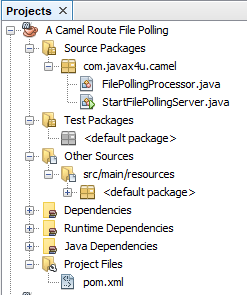

## Execution steps
If you want to run this project directly then follow below steps otherwise import it in Netbeans or other java IDE
	
	Open command prompt and run build_and_run.bat.bat
	

Directory Structure

## Install as service
	open cmd and goto release folder
	change path according to your computer
	E:\camel-socket\release>InstallAsWindowsService.bat
	
Service Screenshot

	
	
## Common Errors

### java.net.ConnectException: Connection refused: connect
	solution start the server first
### io.netty.handler.codec.TooLongFrameException: Adjusted frame length exceeds 1048576: 1214606448 - discarded

change **allowDefaultCodec=false**  in URI

	from("netty:tcp://localhost:4209?allowDefaultCodec=false&sync=false")

### How will someone download your code and run it, to check whether it is working still or not.

### What if someone wants to make folder paths configurable outside the jar

	There are many ways for alien configuration. Most prominent are java -D system properties and arguments to main method, or if you are using spring then configure in xml file as bean properties and use ClasspathXmlContext for xml file.
	Or you can use htttp based properties loader like spring boot. It depends upon your program environments.
	
### 

[Reference Sites](http://www.masterspringboot.com/various/camel/using-camel-netty-components-to-manage-socket-routes)

	
